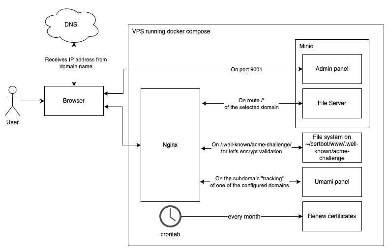
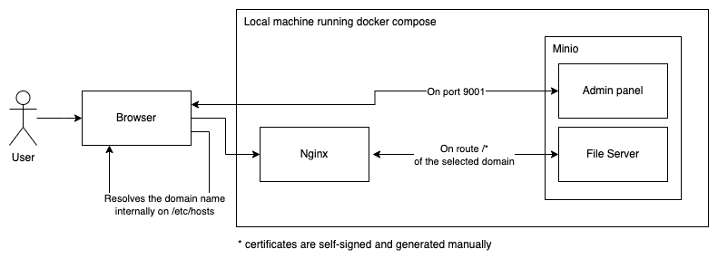

# Static Hosting

This project demonstrate how to self-host multiple websites on a 5.99 euro/month VPS (https://webdock.io/en/pricing).

It uses:
- **Minio** (https://min.io/) to have a self-hosted alternative to AWS S3. Since it uses the same api as AWS S3, it is compatible with AWS CLI, more info [here](minio/notes.md)
- **Umami** (https://umami.is/) for an open-source, cookieless alternative to Google Analytics
- **Nginx** (https://www.nginx.com/) to handle caching and forwarding of traffic to Minio
- **Let's encrypt** (https://letsencrypt.org/) to handle SSL certificates
- **Docker** (https://www.docker.com/) as a containerization system
- **Docker Compose** (https://docs.docker.com/compose/) to orchestrate the containers
- **Ansible** (https://www.ansible.com/) to set everything up on a shiny new empty VPS

... giving for granted that the rented VPS will be an Ubuntu or Debian machine.

Since Webdock gives by default Ubuntu machines, this repo is optimized for Ubuntu.

### How it works high level in a production environment

### How it works high level in a development environment

# Getting started on your local machine

1. Decide your website names (referred as `WEBSITE_NAMES` in this guide), your development domains (referred as `WEBSITE_DEVELOPMENT_DOMAINS`)
2. Install on your machine docker
3. Generate self-signed certificates for local development
4. Modify your /etc/hosts to put a redirect from your `WEBSITE_DEVELOPMENT_DOMAINS` to your localhost
5. Customize the Nginx files to reflect your `WEBSITE_DEVELOPMENT_DOMAINS`, self-signed certificate files, the Minio url that will point at your `WEBSITE_NAMES` and the Umami nginx configuration
6. Decide an user/password combination for Minio and write it in the docker compose file `./docker-compose.yml`
7. Spin up Nginx and Minio with docker compose locally
8. Go on the Minio portal and create a bucket for each `WEBSITE_NAMES`, called `WEBSITE_NAME`, containing your website files
9. Update Minio policy to give permission to everyone to see the files
10. Navigate with the browser to one of your `WEBSITE_DEVELOPMENT_DOMAINS` domain and you should see your website

For more detailed information look at [readme-assets/getting-started-local-guide.md](readme-assets/getting-started-local-guide.md)

# Getting started on a remove server

1. Decide your website names (referred as `WEBSITE_NAMES` in this guide) and your production domains (referred as `WEBSITE_PRODUCTION_DOMAINS`). Make sure that these domains are different from the ones you have chosen for development or you'll have to change your `/etc/hosts` everytime you'll switch between production and development.
2. Rent a VPS on your favorite VPS provider
3. Follow the readme in the [vps-setup folder](../vps-setup/README.md) to 
    1. install on the VPS all the needed dependencies
    2. push to the VPS all the file from this repository that are needed
4. SSH into the server and generate self-signed certificates
5. Point your domain on your VPS IP address
6. SSH into the server and customize the Nginx files to reflect your `WEBSITE_PRODUCTION_DOMAINS`, self-signed certificate files, the Minio url that will point at your `WEBSITE_NAMES` and the Umami nginx configuration
7. SSH into the server and spin up Nginx and Minio with docker compose locally
8. Go on the Minio portal and create a bucket for each `WEBSITE_NAMES`, called `WEBSITE_NAME`, containing your website files
9. Update Minio policy to give permission to everyone to see the files
10. Generate Let's Encrypt certificates
11. Modify the Nginx configuration to use the Let's Encrypt certificates
12. Navigate with the browser to one of your `WEBSITE_PRODUCTION_DOMAINS` domain and you should see your website
13. Set up a crontab to renew certificates
14. (optional) Check your certificates

For more detailed information look at [readme-assets/getting-started-remote-guide.md](readme-assets/getting-started-remote-guide.md)

# Some notes regarding Umami

[umami/README.md](umami/README.md)
