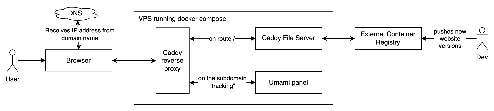

# Static Hosting

This project demonstrate how to self-host a NextJS website on a 5.99 euro/month VPS (https://webdock.io/en/pricing). It can easily be extended to support other frameworks as the static files of NextJS are wrapped in a Caddy webserver.

It uses:
- **Umami** (https://umami.is/) for an open-source, cookieless alternative to Google Analytics
- **Caddy** (https://caddyserver.com/) to handle caching and forwarding of traffic to Umami and the containerized website. It takes care automatically of the HTTPS certificates
- **Docker** (https://www.docker.com/) as a containerization system
- **Docker Compose** (https://docs.docker.com/compose/) to orchestrate the containers
- **Ansible** (https://www.ansible.com/) to set everything up on a shiny new empty VPS

... giving for granted that the rented VPS will be an Ubuntu or Debian machine.

Since Webdock gives by default Ubuntu machines, this repo is optimized for Ubuntu.

### Architecture



## Prerequisites

Install docker on your development machine (https://docs.docker.com/get-docker/)

## Getting started

The following guide is optimized for static websites built on NextJS. It is very easy to adapt it to other framework as the `./out` folder with the static files of NextJS is wrapped by a Caddy webserver. Potentially every static website can be wrapped in the same way.

To switch easily from one environment to the other we'll use to `.env` files:

- `./envs/.env.dev`: In this environment all the containers will be run locally on the development machine. It is meant to be a quick-to-use qa environment.
- `./envs/.env.qa`: This should be a VM that simulate the production environment, with the same operating system and configurations.
- `./envs/.env.prod`: This environment is the actual server

The `.env.X` file should look like this: [./envs/.env.example](./envs/.env.example)

Fields explanation:

| Field | Explanation |
| --- | --- |
| ENV | The environment, for example `dev`, `qa` and `prod` |
| DOMAIN | Domain used by Caddy. For exposing the website on localhost choose `localhost`, in production use the domain you've bought like `domain.com` |
| UMAMI_HASH_SALT | Random unique string useful for umami |
| POSTGRES_USER | New username for umami database |
| POSTGRES_PASSWORD | The password for that new user |
| BUILD_PLATFORM | The platform architecture where the container will run. For example for Apple Silicon it is `linux/arm64` and for standard servers is `linux/amd64` |
| REMOTE_WORKING_FOLDER | In which folder on the server you want to put your scripts and configurations. This folder needs to exist |
| WEBSITE_PROJECT_PATH | Full path location of your NextJS project, so it will be built using this Dockerfile [./website/nextjs/Dockerfile](./website/nextjs/Dockerfile) |
| VPS_ADDRESS | The address of the remote machine that will run the containers, could be a local address for the VM or a remote address for the production server |
| VPS_USER | The user that is configured on the machine located at `VPS_ADDRESS` |

Environmental Variables needed by the NextJS frontend will be placed in the root directory of `WEBSITE_PROJECT_PATH` and will be called `.env-build-dev`, `.env-build-qa` and `.env-build-prod`. Inside there will be the variables like:

```bash
NEXT_PUBLIC_UMAMI_SCRIPT_URL=https://tracking.localhost/script.js
NEXT_PUBLIC_UMAMI_ID=********-****-****-****-************
```

### Set up on your local machine (Dev environment)
 
1. Build your static website in a small Caddy container:
    - Build your Nextjs website and then run here
        ```bash
        make build-and-run ENV=dev
        ```
2. Navigate on https://localhost and https://tracking.localhost to test that everything works

### Set up on a VM (Optional QA environment)

1. Set up your VM. If you want to use QEMU, here you can find help: [./readme-assets/qemu.md](./readme-assets/qemu.md)
2. Follow the readme in the [vps-setup folder](../vps-setup/README.md) to install on the VM all the needed dependencies
3. Build your static website in a small Caddy container:
    - Build your Nextjs website and then run here
        ```bash
        make build-and-deploy ENV=qa
        ```
4. To visit the result, use an SSH tunnel to map your local ports to the VM ones
    ```bash
    source ./envs/.env.qa
    ssh -L 8080:localhost:80 -L 8443:localhost:443 $VPS_USER@$VPS_ADDRESS
    ```
5. Visit https://localhost:8443 

### Set up on a remote server (Prod environment)

1. Rent a VPS on your favorite VPS provider. Good examples: https://webdock.io/en, https://www.vultr.com/, https://www.linode.com/
2. Follow the readme in the [vps-setup folder](../vps-setup/README.md) to install on the VPS all the needed dependencies
3. Get a domain and point it on your VPS IP address
4. Build your static website in a small Caddy container and push it to a remote container registry:
    - Build your Nextjs website and then run here
        ```bash
        make build-and-deploy ENV=prod
        ```

## Useful commands

### Start the containers

```bash
# With docker compose running on the pc
make run-local ENV=dev

# With docker compose running on the vm
make run-remote ENV=qa

# With docker compose running on the server
make run-remote ENV=prod
```

### Download a folder for backup purposes

```bash
# Load the environment variables
source /envs/.env.prod

# Download recursively a folder on the server into your machine
rsync -chavzP --stats $VPS_ADDRESS:/remote/folder/path /local/folder/path
```

### Push on the server new configurations and files

```bash
make update-server ENV=prod
```

### Load env vars in current shell

Useful for loading them up and then debug freely having all the environmental variables loaded up of the specified environment:

```bash
./scripts/with-env.sh <env>
# Example
# ./scripts/with-env.sh dev
# ./scripts/with-env.sh qa
# ./scripts/with-env.sh prod
```

## Notes

- [umami/README.md](umami/README.md)
- [Google Search Console Setup](./readme-assets/google-search-console.md)
