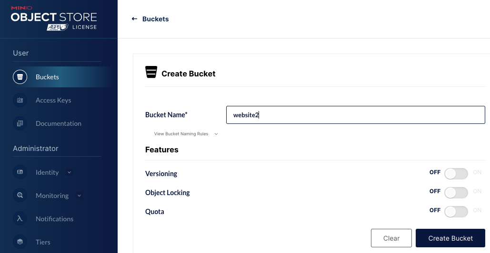
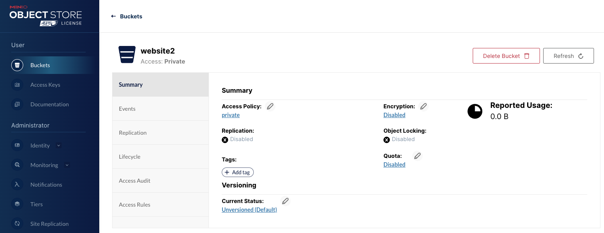

# Getting Started Local Guide

1. Decide your website names (referred as `WEBSITE_NAMES` in this guide), your development domains (referred as `WEBSITE_DEVELOPMENT_DOMAINS`)
2. Install on your machine docker
3. Generate self-signed certificates for local development
4. Modify your /etc/hosts to put a redirect from your `WEBSITE_DEVELOPMENT_DOMAINS` to your localhost
5. Customize the Nginx files to reflect your `WEBSITE_DEVELOPMENT_DOMAINS`, self-signed certificate files, and the Minio url that will point at your `WEBSITE_NAMES`
6. Decide an user/password combination for Minio and write it in the docker compose file `./docker-compose.yml`
7. Spin up Nginx and Minio with docker compose locally
8. Go on the Minio portal and create a bucket for each `WEBSITE_NAMES`, called `WEBSITE_NAME`, containing your website files
9. Update Minio policy to give permission to everyone to see the files
10. Navigate with the browser to one of your `WEBSITE_DEVELOPMENT_DOMAINS` domain and you should see your website

## Step 1

We'll take for example in this guide that your websites are called `website1` and `website2` and the two development domains are called `website1dev.com` and `website2dev.com`

## Step 2

To install Docker follow the instructions here: https://docs.docker.com/get-docker/

## Step 3

To generate self-signed certificates for local development execute this command command from the root folder of the project:

```
sudo openssl req -x509 -nodes -days 365 -newkey rsa:2048 -keyout ./self-signed/private/nginx-selfsigned.key -out ./self-signed/certs/nginx-selfsigned.crt
```

change it to be readable

```
sudo chmod +x ./self-signed/private/nginx-selfsigned.key
```

## Step 4

Modify your /etc/hosts to put a redirect from your `WEBSITE_DEVELOPMENT_DOMAINS` to your localhost with a command like

```
sudo nano /etc/hosts
```

and add at the end the lines referring to your domains (in this guide two)

```
127.0.0.1 website1dev.com www.website1dev.com
127.0.0.1 website2dev.com www.website2dev.com
```

Doing this, when you'll search on your browser website1dev.com or www.website1dev.com, it will be resolved by your local machine to 127.0.0.1, that is localhost.

## Step 5

The file `nginx/conf/nginx.conf` is the default file that will get mounted and used by the nginx container and there is no need for modifications here.

The configurations for your websites goes under `nginx/conf/custom-conf`, where you'll find already there some real-world examples.

The files `nginx/conf/custom-conf/website1dev.com` and `nginx/conf/custom-conf/website2dev.com` already represents two fully working configurations to expose `website1` and `website2`.

## Step 6

If you take a look at `./docker-compose.yml` you'll see that by default the variables `MINIO_ROOT_USER` and `MINIO_ROOT_PASSWORD` are already set up with default values. Feel free to substiture them.

## Step 7

From the root of the project run the command

```
docker compose up
```

## Step 8

Go on http://localhost:9001/ and you'll be redirect on the Minio admin panel.

The login credentials are the ones defined in the `./docker-compose.yml` in the environmental variables `MINIO_ROOT_USER` and `MINIO_ROOT_PASSWORD`.

Now that you've logged in, from the "Buckets" tab you'll be able to create a new bucket.



If you are using the default nginx configuration present in this repository in the files `nginx/conf/custom-conf/website1dev.com` and `nginx/conf/custom-conf/website2dev.com`, you'll have to create two buckets names `website1` and `website2` and you'll have to place in the root of those two buckets a folder named `out` and, inside that folder, files of your two websites.

## Step 9

To enable unauthenticate accounts to view (but not delete, upload or modify) the files present in your buckets, for each bucket go to `Manage -> Summary -> Access Policy`. Make the access policy `custom` and paste the content of the file `minio/policies/minio-website1-access-policy.json` for website1 and `minio/policies/minio-website2-access-policy.json` for website2.

If your buckets are not called `website1` and `website2` remember to change the policies accordingly.



## Step 10

Well Done! 

You should be able to hit https://website1dev.com and see your website in the website1 bucket. Likewise for website2!
